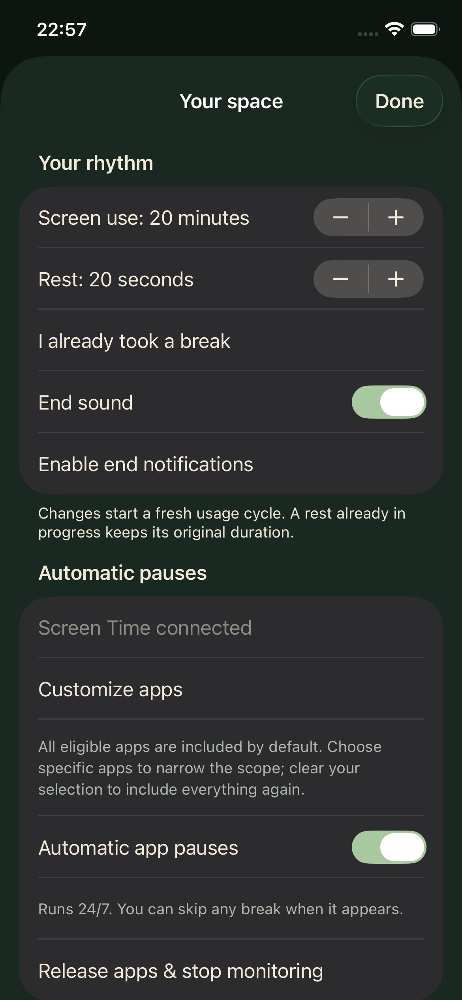
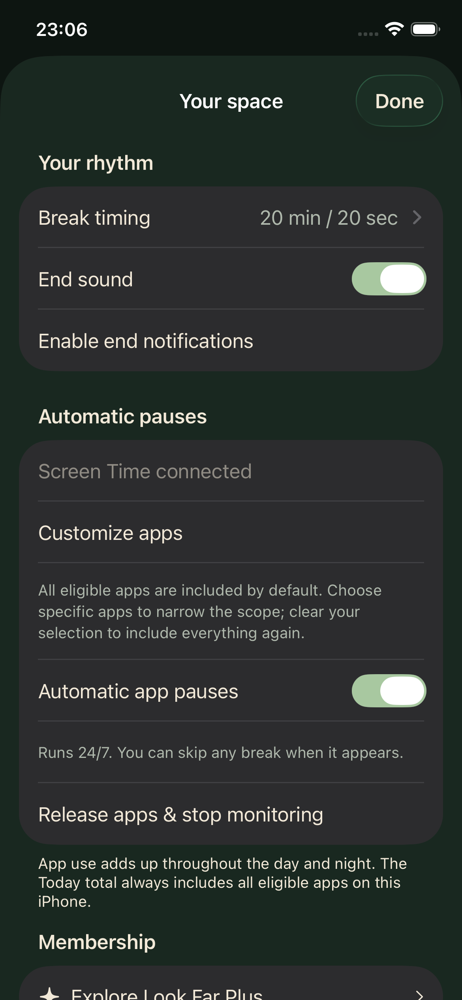
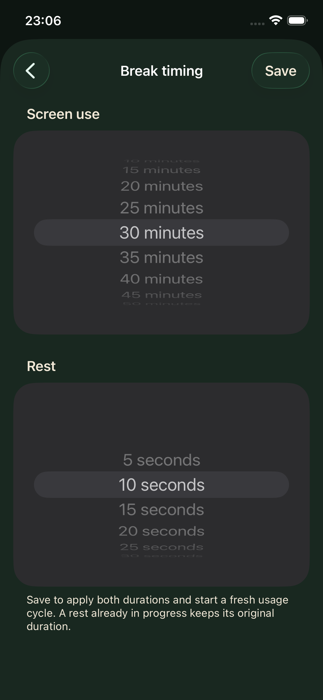
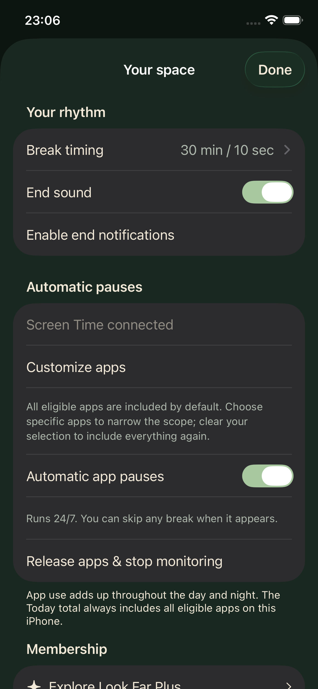
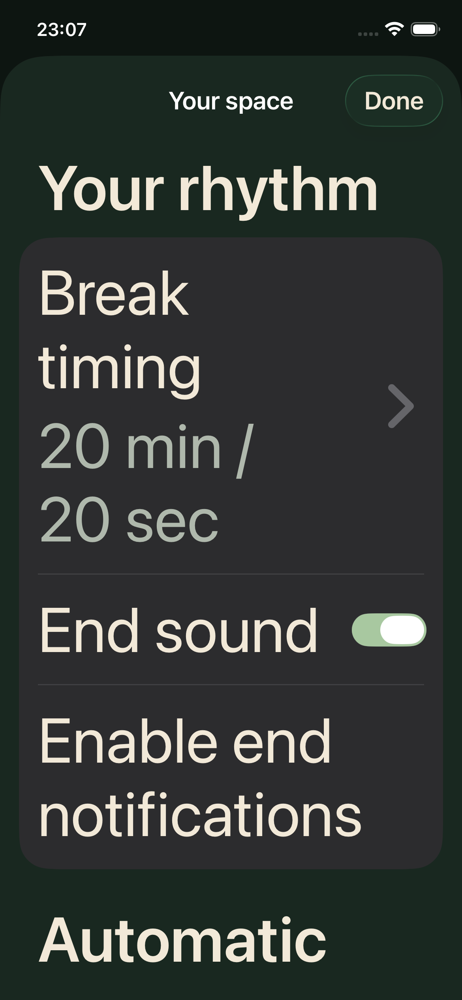
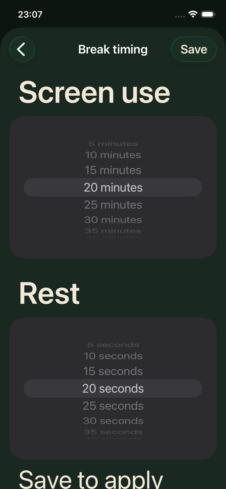

# Settings UI audit

Captured on the Look Far iOS 26.5 Simulator at 390 × 844 points, September 25, 2026. Scope: changing 20/20 to 30/10 in Settings, cancelling edits, saving, and checking the largest Dynamic Type size. These screenshots were captured and inspected during this audit.

1. **Original Settings — issues fixed.** Numeric steppers require repeated taps for larger changes. “I already took a break” mixes a one-time cycle reset with persistent preferences. The existing units and native form grouping are clear.

2. **Settings entry — clear.** One “Break timing” row shows the saved minutes and seconds. The break-confirmation action is removed from Settings and remains on the actual break prompt. Other preference controls retain their existing native layout.

3. **Timing editor — improved.** Full-width native wheels support scrolling, with explicit units and a highlighted selection. Back cancels draft edits; Save applies both values once. The editor shows Back and Save without a competing Done action. This also avoids restarting monitoring for each intermediate selection.

4. **Saved result — verified.** Saving 30 minutes / 10 seconds returns to the updated summary. Reopening retains both values, and a manual rest completes after 10 seconds. The UI test also confirms that Back leaves the original 20/20 values unchanged.

5. **Largest-text Settings — usable.** The title and timing summary wrap instead of truncating. Opening the editor and reaching Done passed the accessibility-size UI check. The rest of the form remains scrollable.

6. **Largest-text editor — controls reachable.** Both wheels and Save remain reachable. The explanatory footer continues below the viewport and can be scrolled into view. Native wheel values retain the system wheel text size, so spoken values and adjustment should still be checked with VoiceOver.

Validation: the five affected Simulator flows pass (timing edit/save/cancel, largest text, contextual break confirmation, membership navigation, and access revocation from Settings), and the unsigned iOS Release build passes. Initial test selector failures were corrected using captured native accessibility hierarchies and the affected tests were rerun successfully.

Limits: this is a scoped settings audit, not a full accessibility certification. VoiceOver speech/traversal, Switch Control, and physical-device Screen Time behavior were not exercised. No clipped selected value or blocked primary action was found in the accepted captures.
